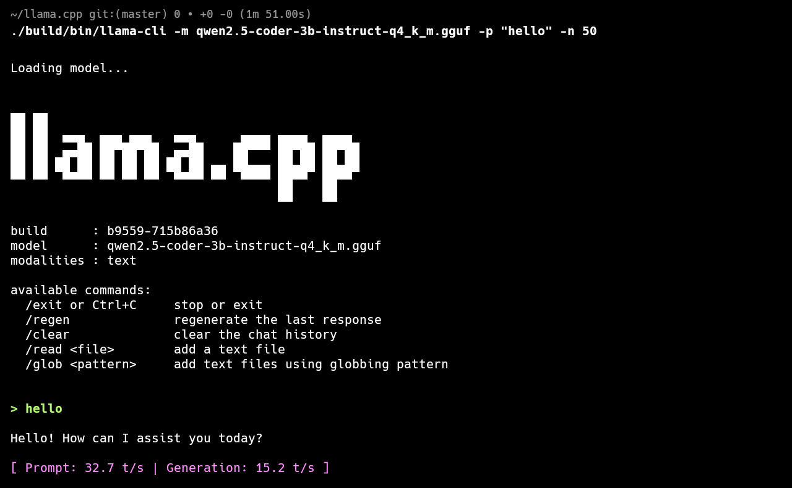

# Local LLM Instrumentation, Tracing, and Replay Platform

A lightweight, non-invasive telemetry and diagnostic Text User Interface (TUI) for local transformer models running on `llama.cpp`. It hooks directly into the model's execution pipeline to capture layer-by-layer execution metrics, attention heatmaps, and tensor statistics in real-time, rendering them via an interactive 5-panel terminal interface.

This project solves the "black box" problem of local LLM inference by providing deep visibility into intermediate activations, latency bottlenecks, and numerical stability issues without requiring any modifications to the upstream `llama.cpp` source code.



---

## Features

- **Non-Invasive Interception:** Links against `libllama.so` and intercepts model inference without modifying the upstream source code.
- **Topology Discovery:** Automatically maps raw ggml compute graphs to logical transformer blocks (e.g., Attention, MLP, LayerNorm).
- **Live Packet Stream:** A high-speed, real-time log of telemetry events categorized by layer type and compute device.
- **Attention Matrix Visualizer:** Real-time visual representation of attention weights using ` ░▒▓█` heatmaps with adjustable contrast and navigable viewports.
- **Runtime Metrics Inspector:** Real-time extraction of tensor shapes, latency deltas, sparsity rates, means, and maximum absolute values.
- **Numerical Anomaly Ledger:** Intelligent background detection of `NaN/Inf` occurrences, clipping risks (fp16 saturation), dead layers (high sparsity), and latency hotspots with a sliding window median.
- **Vim-Inspired Keybindings:** `h`, `j`, `k`, `l` navigation, `Tab` cycling, `+`/`-` zoom/contrast controls, and `f` for fullscreen toggling.

---

## Architecture & How It Works

The platform uses a heavily optimized multi-threaded architecture to ensure that the user interface remains at 60 FPS without slowing down the model inference.

### Execution Flow (Startup to Shutdown)
1. **Startup:** `tui_hello` initializes the FTXUI screen, creates an `AppState`, and boots up a background worker thread containing the `LlamaInterceptor`.
2. **Model Loading:** The interceptor loads the specified GGUF model via the `llama.cpp` C API and creates a `llama_context`.
3. **Execution Pipeline & Interception:** The model enters a continuous text generation loop. For each token, the interceptor uses `llama_decode` wrapped with `cb_eval` (a graph node callback). The callback intercepts internal tensor states (like attention matrices, MLP layers, etc.).
4. **Telemetry Processing:** Captured tensors are summarized (sparsity, mean, max) and packaged into an 80-byte fixed-size `TelemetryPacket`.
5. **Ring Buffer & Queueing:** Packets are safely pushed into a lock-based bounded `RingBuffer` to limit memory consumption and handle backpressure.
6. **UI Rendering:** The main thread drains the `RingBuffer` at 30+ FPS, updating the `AppState`. FTXUI triggers a redraw, updating all 5 panels based on the new data and user keyboard input.
7. **Shutdown:** Pressing `q` signals the inference thread to stop and gracefully shuts down the context and TUI.

### Performance Optimizations & Notable Engineering Choices
- **Zero Allocation Telemetry:** The `TelemetryPacket` is a fixed-size (80 bytes) structure that is trivially copyable. It entirely avoids dynamic allocations (like `std::string` or `std::vector`) on the hot path to prevent heap fragmentation.
- **Bounded Memory:** The thread-safe `RingBuffer` enforces a strict capacity limit, ensuring that long-running inferences don't exhaust system RAM over time.
- **Thread Separation:** The model inference and graph interception run in a background thread, while the UI rendering loop runs on the main thread.
- **Callback-Based Graph Hooking:** Tensors are intercepted directly from the `ggml_cgraph` via the `cb_eval` evaluation callback during `llama_decode`, successfully extracting telemetry without branching or modifying the main model execution code.

---

## Project Structure

The codebase is organized cleanly to separate the user interface, backend telemetry, and model binding layers.

| Directory / File | Description & Responsibility |
|------------------|------------------------------|
| `CMakeLists.txt` | Build system definitions linking `llama.cpp` and `vcpkg` dependencies. |
| `vcpkg.json` | Dependency manifest specifying required libraries (`ftxui`, `spdlog`, `fmt`, `catch2`, `nlohmann-json`). |
| `include/core/` | Headers for internal data structures and backend analysis engines (`RingBuffer.hpp`, `TelemetryPacket.hpp`, `AnomalyDetector.hpp`). |
| `include/hook/` | Declarations for `llama.cpp` interception bindings (`LlamaInterceptor.hpp`). |
| `include/tui/` | Headers for the FTXUI interface, shared state, and panel rendering components (`AppState.hpp`, `PanelTopology.hpp`, etc.). |
| `src/core/` | Implementation of telemetry queueing and backend numerical analysis. Interacts directly with the TUI thread by passing processed data. |
| `src/hook/` | The bridge between the TUI and the LLM. Executes inference, intercepts tensors during the forward pass, and packages them into `TelemetryPacket` structures. |
| `src/tui/` | Rendering engine built using FTXUI. Consumes telemetry data and drives the interactive UI panels (`tui_hello.cpp`). |
| `tests/` | Catch2 unit test suite (`test_ringbuffer.cpp`, `test_anomaly.cpp`). |
| `third_party/` | Contains the `llama.cpp` git submodule (C library) used for inference. |

---

## Configuration & Environment Variables

The platform can be customized dynamically using the following environment variables:

| Variable | Description | Default |
|----------|-------------|---------|
| `LLM_TUI_MODEL` | Absolute path to the local GGUF model file you wish to trace. | `/home/manish/models/qwen2.5-coder-3b-instruct-q4_k_m.gguf` |
| `LLM_TUI_RING_BUFFER` | The maximum capacity of the telemetry ring buffer. Reduces RAM footprint when lowered. | `1024` (Minimum allowed is `64`) |

---

## Telemetry, Monitoring, and Debugging

The platform continuously monitors the model in the background:
- **Numerical Anomaly Ledger:** The `AnomalyDetector` evaluates telemetry packets and flags anomalies like `OutlierFeature` (Z-Score > threshold), `ClippingRisk` (FP16 saturation), `DeadLayer` (excessive sparsity), and `LatencyHotspot` (computation spikes).
- **Logging:** `spdlog` provides internal debug logging, tracing, and diagnostics printed synchronously to stdout or the integrated TUI panels.
- **Chronological Profiling:** The `RingBuffer` tracks system metrics like execution time via nanosecond-precision `std::chrono` clocks.

---

## Build Instructions

### Dependencies
- **CMake ≥ 3.20**
- **GCC ≥ 13** or **Clang ≥ 16** (C++20 support required)
- **vcpkg** (For downloading `ftxui`, `spdlog`, `fmt`, `nlohmann-json`, and `catch2`)
- **A NerdFont** (e.g., JetBrainsMono Nerd Font for correct rendering of the heatmap and icons)
- **A GGUF Model** (e.g., Qwen2.5-Coder-3B-Instruct)

### Build Commands

```bash
cd /home/manish/llm-tui
git submodule update --init --recursive

# Configure the build system (Make sure VCPKG_ROOT is set in your environment)
cmake -B build -S . -DCMAKE_TOOLCHAIN_FILE=$VCPKG_ROOT/scripts/buildsystems/vcpkg.cmake

# Compile
cmake --build build -j$(nproc)

# Run unit tests
ctest --test-dir build --output-on-failure
```

### Run Commands

Start the primary Text User Interface application, ensuring you pass your model path if it differs from the default:

```bash
LLM_TUI_MODEL="/path/to/your/model.gguf" ./build/tui_hello
```

---

## Keybindings

| Key | Action |
|-----|--------|
| `Tab` / `Shift+Tab` | Cycle focus across the 5 panels |
| `h` / `l` | Previous / next panel or left / right navigation (vim-style) |
| `j` / `k` | Down / up navigation in the focused panel (vim-style) |
| `Space` | Freeze / unfreeze the Live Packet Stream scrolling |
| `+` / `-` | Increase / decrease Attention Matrix weight contrast |
| `f` / `F` | Toggle fullscreen mode for the currently focused panel |
| `q` / `Esc` | Quit the application |
